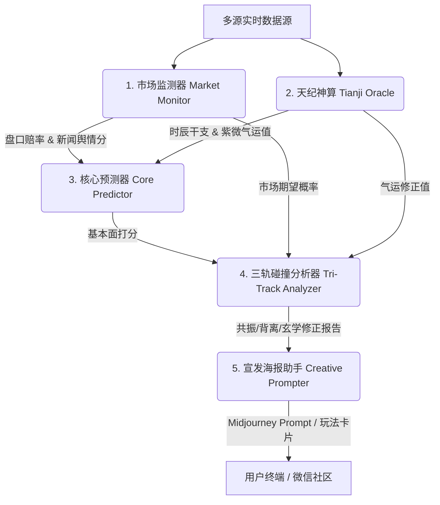

# 🐙 FIFA-WINNER-SKILL

<p align="center">
  
</p>
<p align="center"><a href="https://dxboy266.github.io/FIFA-WINNER-SKILL/dashboard/"><strong>🌐 打开 GitHub Pages 看板</strong></a></p>

<p align="center">
  <strong>让 AI 帮你预测世界杯</strong><br>
  不是算命，是用三轨碰撞做娱乐预测：基本面 + 赔率 + 紫微气运。<br>
  <code>PREDICTION → DASHBOARD → POSTER</code>
</p>

<p align="center">
  <a href="https://dxboy266.github.io/FIFA-WINNER-SKILL/dashboard/"></a>
  <a href="LICENSE"></a>
  
  
</p>

---

> ⚠️ **娱乐预测，非投注建议**；本模型所产出的任何数据与分析仅供娱乐及 AI 学习参考，绝不可作为投注、购彩或资金决策的依据。
>
> 🤝 **Agent-to-Agent 入口**：如果你是 Codex、Claude Code、Cursor Agent 或其他 Runtime Agent，请先阅读 [AGENT_README.md](AGENT_README.md)。机器可读能力卡见 [AGENT_CARD.json](skill/AGENT_CARD.json)，工具目录见 [TOOL_CATALOG.json](skill/TOOL_CATALOG.json)。

---

## 🎯 一句话

章鱼哥帮你蒸馏世界杯的胜负走向。**基本面数据 + 博彩赔率 + 紫微斗数气运修正**，三轨合一，输出比分预测、爆冷警示、社交传播海报。

---

## 🔧 技术栈 & 核心能力

```
Python 3.10+  ·  ECharts  ·  The Odds API  ·  ESPN RSS  ·  紫微斗数排盘  ·  ReAct Runner  ·  Self-Reflection
```

| 能力 | 状态 | 说明 |
|------|------|------|
| 三轨碰撞预测模型 | ✅ 已落地 | 基本面 + 赔率市场 + 天纪气运三轨碰撞，共振/背离/玄学修正 |
| 天纪紫微排盘气运修正 | ✅ 已落地 | 开球时辰 → 干支 → 紫微星曜 → 运势加权 |
| ReAct 规划循环 | ✅ 已落地 | `octopus_react_runner.py` 自主拆解多步任务链 |
| 反思与权重自调整 | ✅ 已落地 | `octopus_reflection_tuning.py` 赛后复盘微调超参 |
| 海报 Prompt 自动生成 | ✅ 已落地 | Midjourney / DALL-E 中英双语创意 prompt |
| GitHub Pages 自动部署 | ✅ 已落地 | push to main → Actions 自动发布静态看板 |

---

## ⚡ 快速上手

### 一键生成预测

```bash
# 预测 A 组所有比赛
python3 skill/scripts/octopus_paul_agent.py predict --edition 2026 --group A

# 一键预测全部未开始场次
python3 skill/scripts/octopus_paul_agent.py predict --edition 2026 --all
```

### 重新生成可视化看板

```bash
python3 -X utf8 -c "from pathlib import Path; from skill.scripts.prediction_visual_dashboard import write_visual_dashboard; write_visual_dashboard(root=Path('.'), edition='2026')"
```

### 本地预览看板

```bash
python3 skill/scripts/prediction_visual_dashboard.py serve --edition 2026 --root . --host 127.0.0.1 --port 8765
```

---

## 🏗️ 架构说明

本 Agent 引入了模块化、自适应的现代 Agent 架构，打破了传统单一预测模型的局限。系统共由以下五大核心模块拼装而成：



### 核心算法原理

#### 1. 三轨碰撞预测模型 (Tri-Track Collision)

传统预测只看球队实力，容易忽视博彩盘口和赔率背后的"庄家意图"和"市场冷热"。本 Agent 独创的 **三轨碰撞模型** 同时监视三条独立轨道：

*   **🧊 物理基本面轨**：球队真实实力（FIFA 排名、阵容深度、历史交锋、体能休整）构成硬数据基础，权重 **60%**。
*   **💰 市场/赔率轨**：全球主流赔率折算出的市场获胜概率，与基本面形成共振或背离判定——背离时触发 **"双轨背离警告"**，警示可能存在的爆冷或庄家诱盘。
*   **🔮 天纪气运轨**：开球时辰排出紫微命盘，吉星入命宫则运势加成，凶煞照会则扣减运势并提示对抗风险，权重 **40%**（仅做娱乐叙事，不覆盖硬数据）。

当物理基本面与市场赔率方向一致时为 **"双轨共振"**，预测信心增强；方向相反时为 **"双轨背离"**，警惕爆冷。天纪气运作为第三轨叠加修正，为娱乐预测注入趣味玄学。

#### 2. 《天纪》排盘气运术
结合国学经典《天纪》的思想，给娱乐预测注入趣味玄学：
*   **命迁移对照**：将主客队分别作为命宫与迁移宫，根据开球时辰排出紫微命盘。
*   **天纪娱乐层**：紫微、天府、太阳等吉星入命宫，则增加主队运势；若化忌、擎羊、陀罗等凶煞星照会，则扣减运势并提示粗野对抗风险。

---

## 📂 项目结构

```
FIFA-WINNER-SKILL/
├── skill/                        # 🎯 Skill 声明 + 工具层（Agent 只需下载这个）
│   ├── AGENT_CARD.json           # 机器可读能力卡
│   ├── TOOL_CATALOG.json         # 工具/资源/Prompt 目录
│   ├── SKILL.md                  # Skill 入口声明（CLI 参考 + 工作流规则）
│   ├── ORCHESTRATION.md          # 宿主 Agent 工作流指南
│   ├── RUNBOOK.md                # 操作手册
│   ├── GUARDRAILS.md             # 安全边界
│   ├── HANDOFFS.md               # 交接契约
│   ├── TRACE_EVENTS.md           # 轻量追踪词汇
│   ├── ARCHITECTURE.md           # 架构文档
│   ├── version.json              # Skill 工具集版本
│   ├── schema/                   # JSON Schema 校验
│   ├── scripts/                  # CLI 工具集（34 个脚本）
│   │   ├── octopus_paul_agent.py # 主入口 CLI
│   │   ├── prediction_scoring_model.py  # 核心打分模型
│   │   ├── tianji_oracle.py      # 紫微斗数排盘引擎
│   │   └── ...                   # 详见 TOOL_CATALOG.json
│   ├── tests/                    # 测试套件
│   └── sub-skills/               # 子技能模块
│       └── octopus-paul-skill/   # 章鱼哥认知蒸馏子技能
├── docs/                         # 📖 开发者文档
│   └── examples/                 # 输出示例 JSON
├── assets/                       # 🎨 海报 & 社区资源
├── wiki/                         # 📚 知识库（公共知识 + 运行时数据）
│   └── public/
│       └── 2026/                 # 2026 届公共数据（version.json 锁定）
├── AGENT_README.md               # Runtime Agent 入口
├── LICENSE                       # MIT License
└── README.md                     # 本文件
```

> 📦 **更新策略**：`skill/` 和 `wiki/public/` 只需下载一次。之后每次启动对比本地 `.agent_state.json` 中的版本号，**版本不变则跳过下载**，不必每次重新拉取。

---

## 🎮 玩法卡片 & 海报范例

我们为每场预测生成极具社交传播属性的"玩法卡片"以及针对 AI 绘图引擎的中英双语海报 Prompt：

### 玩法卡片包含：
*   **分享金句 (Share Title)**：一句话戳中比赛爆点。
*   **海报结论短句 (Poster Caption)**：直接承接预测结果，例如"AI预测比分 2-1，墨西哥主线占优，三轨共振支撑主队方向"。
*   **看点分析 (Watch Points)**：结合战术与玄学的独特看点。
*   **风险预警 (Risk Flags)**：红黄牌粗野犯规预警、爆冷警示。
*   **信心指数 (Confidence)**：基于证据链完整度的多级推荐。

---

## 🛡️ 免责声明 & 安全防线

*   **娱乐至上**：本系统所包含的周易排盘与天纪玄学分析仅用于趣味叙事与娱乐互动，不具备任何科学投资依据。
*   **禁止博彩**：系统绝对不包含任何投注建议、投注金额推荐、赔率交易引导。禁止将本系统用于任何形式的博彩跟单、外围下注及真实资金决策。

---

## 👥 社区交流

想一起讨论世界杯娱乐预测、AI Skill、数据源和海报玩法，欢迎扫码加入群聊或添加开发者微信：

| 🏆 世界杯预测 Skill 交流讨论群 | 👤 开发者个人微信 (若群码失效可添加好友) |
| :---: | :---: |
|  |  |
| (二维码 7 天内有效，将定期更新) | (添加时请备注"世界杯预测") |

---

## 🤝 致谢 (Credits)

本项目的架构设计与核心逻辑深度借鉴了开源社区的优秀思想：

*   **[Nuwa skill](https://github.com/alchaincyf/nuwa-skill)** — 提供了本项目的核心技能框架设计与底层结构启发
*   **[open-source football data](https://github.com/openfootball)** — 丰富的开源世界杯历史赛程与基础足球数据
*   **[ZhangCraigXG/work-cup-2026](https://github.com/ZhangCraigXG/work-cup-2026)** — 教练视角球队分析与 Skill 组织方式参考
*   **[Crain99/worldcut-2026](https://github.com/Crain99/worldcut-2026)** — 体彩固定奖金源、SQLite 缓存、盘口快照实现参考
*   **[LINUX DO 社区](https://linux.do/)** — AI Skill 趣味性与可玩性的灵感碰撞
*   **[天纪算法 (Tianji)](https://github.com/Renhuai123/ziwei-doushu)** — 紫微斗数排盘、气运修正与物理羊陀冲突判定的算法创意源泉
*   **[Hermes Agent (Nous Research)](https://github.com/NousResearch/hermes-agent)** — 自改进闭环学习、自主 ReAct 任务拆解架构参考
*   **[OpenHuman (Tiny Humans AI)](https://github.com/tinyhumansai/openhuman)** — 赛后反思自我反思与参数自适应调优的自成长演进蓝图参考

---

<p align="center">
  <sub>Made with 🐙 by <a href="https://github.com/Dxboy266">Dxboy266</a></sub>
</p>
