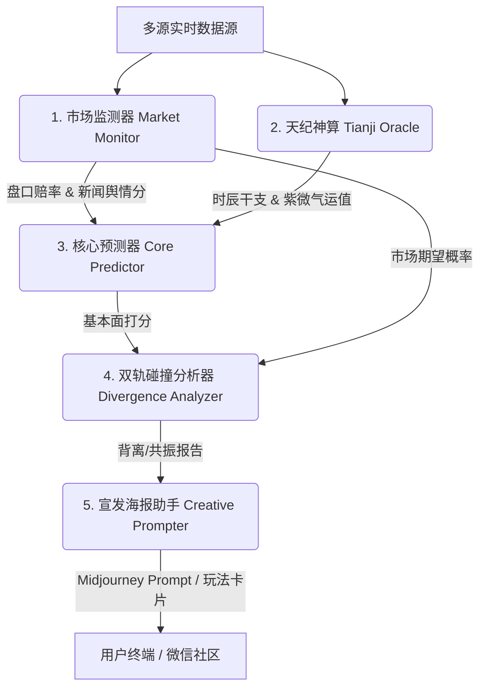

# 🐙 AI章鱼哥：世界杯双轨背离预测 Agent (AI-Octopus-Paul-Predictor-Agent)

> **"我重生了！这一次，我不仅带回了触手对胜利的直觉，还有更强大的科技与东方玄学力量。"**
>
> ⚠️ **娱乐预测，非投注建议**；本模型所产出的任何数据与分析仅供娱乐及 AI 学习参考，绝不可作为投注、购彩或资金决策的依据。

> 🤝 **Agent-to-Agent 入口**：如果你是 Codex、Claude Code、Cursor Agent 或其他 Runtime Agent，请先阅读 [AGENT_README.md](AGENT_README.md)。机器可读能力卡见 [knowledge-base/agent/AGENT_CARD.json](knowledge-base/agent/AGENT_CARD.json)，工具目录见 [knowledge-base/agent/TOOL_CATALOG.json](knowledge-base/agent/TOOL_CATALOG.json)。

---

## 🏗️ 架构说明与设计艺术 (Architecture & Elegant Design)

本 Agent 引入了模块化、自适应的现代 Agent 架构，打破了传统单一预测模型的局限。系统共由以下五大核心模块拼装而成：



### 1. 市场监测器 (Market Monitor)
- **核心脚本**：[worldcup_live_fetcher.py](scripts/worldcup_live_fetcher.py)
- **主要职责**：
  - **盘口赔率**：动态抓取 The Odds API 最新盘口数据，通过无抽水算法（Margin-free）换算为市场的隐含期望概率。
  - **舆情新闻**：订阅 ESPN 等主流体育媒体 RSS Feed，对过去 24 小时的球队动态进行舆情词典扫描（如伤停、内讧等负向词，或复出、提气等正向词），计算球队每日舆情起伏分。

### 2. 天纪神算 (Tianji Oracle)
- **核心脚本**：[tianji_oracle.py](scripts/tianji_oracle.py)
- **主要职责**：
  - 将比赛开球的北京时间映射为农历干支时辰。
  - 运用简易紫微斗数排盘，对比主队（命宫）与客队（迁移宫）的星曜组合。通过紫府日月加权、化忌扣减、羊陀冲突判定，产生玄学轨道修正值与物理对抗的红黄牌警告倾向。

### 3. 核心预测器 (Core Predictor)
- **核心脚本**：[prediction_scoring_model.py](scripts/prediction_scoring_model.py)
- **主要职责**：
  - 整合 FIFA 排名权重换算值（30%）、国家队大名单阵容深度（20%）、历史世界杯底蕴（20%）、休息天数与跨国旅途负荷（15%）以及证据链完整度（15%），计算两支球队的硬实力基本面分。

### 4. 双轨碰撞分析器 (Divergence Analyzer)
- **核心脚本**：在 [prediction_scoring_model.py](scripts/prediction_scoring_model.py) 中嵌入双轨碰撞机制。
- **主要职责**：
  - **双轨对比**：将“基本面轨道（物理基本面 + 玄学气运分）”与“市场轨道（赔率折算期望分）”进行对撞。
  - **共振与背离**：若指向一致，输出“双轨共振（aligned）”的稳健倾向；若指向相反，以“章鱼哥保罗”的逆真神态，发出“双轨背离（divergent）”的冷门警示或防诱盘提示。

### 5. 宣发海报助手 (Creative Prompter)
- **核心脚本**：[poster_prompt_builder.py](scripts/poster_prompt_builder.py) 与 [poster_generator.py](scripts/poster_generator.py)
- **主要职责**：
  - 从预测报告中提炼高可玩性看点、胜负摘要、风险预警，自动合成针对 DALL-E/Midjourney 等海报生成的 Prompt 及负面提示词。

---

## 🌟 核心亮点与算法原理

### 1. 双轨背离预测模型 (Dual-Track Divergence)
传统预测只看球队实力，容易忽视博彩盘口和赔率背后的“庄家意图”和“市场冷热”。
本 Agent 独创的 **双轨背离模型** 会同时监视：
*   **物理 + 玄学轨**：球队真实实力、体能、舆情加上开球时的干支玄学气运。
*   **资金/市场轨**：全球主流赔率折算出的市场获胜概率。
当物理轨道极其看好 A 队，但市场轨道却给出极高阻力时，Agent 将触发 **“双轨背离警告”**，警示可能存在的爆冷或庄家诱盘。

### 2. 《天纪》排盘气运术
结合国学经典《天纪》的思想，给娱乐预测注入趣味玄学：
*   **命迁移对照**：将主客队分别作为命宫与迁移宫，根据开球时辰排出紫微命盘。
*   **天纪娱乐层**：紫微、天府、太阳等吉星入命宫，则增加主队运势；若化忌、擎羊、陀罗等凶煞星照会，则扣减运势并提示粗野对抗风险。当前发布契约为数据模型 **60%**、天纪娱乐层 **40%**，天纪只做娱乐叙事，不能覆盖硬数据。

---

## 🛠️ Agent Runtime 能力与未来规划 (Roadmap)

项目已把章鱼哥从单脚本预测工具升级为可被 Codex、Claude Code 等 runtime agent 调用的有界 Agent。已落地能力如下：

### 1. 有界 ReAct 规划循环 (借鉴 Hermes 风格) **[已落地 / Available]**
`scripts/octopus_react_runner.py` 已提供可审计的 matchday ReAct runner。它会按日期拆解任务：检查赛程、拉取竞彩固定奖金/盘口快照、拉取新闻证据、生成情报简报、执行赛前预测、刷新可视化看板，并把每一步 thought/action/result 写入 trace，方便其他 agent 复盘调用链。

```bash
python3 scripts/octopus_react_runner.py run --edition 2026 --start-date 2026-06-13 --weekend --root .
```

### 2. 反思与权重自调整 (借鉴 OpenHuman 风格) **[已落地 / Available]**
`scripts/octopus_reflection_tuning.py` 已实现赛后反思与胜平负权重微调循环：读取锁定预测和真实赛果评估，写入 self-reflection journal，并在安全边界内微调组件权重。系统约束保持数据模型权重不低于 60%，天纪娱乐层不高于 40%。

```bash
python3 scripts/octopus_reflection_tuning.py tune --edition 2026 --root .
```

### 3. 后续增强 **[规划中 / Planned]**
当前 ReAct runner 是有界执行器，不是无限常驻 daemon；海报生成、外部 web search 和人工补充证据仍建议由 runtime agent 按 RUNBOOK 显式触发。后续可以继续把更多工具接入同一个 trace schema，并增加定时复盘/定时预测编排。

---

## 📂 统一知识库目录结构 (Prediction Evidence)

所有世界杯届次的数据与资料均被整理存放在统一的知识库路径中，便于 Agent 极速读取与理解：

*   `knowledge-base/agent/`：包含 Agent 的 [ARCHITECTURE.md](knowledge-base/agent/ARCHITECTURE.md) 设计架构、[AGENT_CARD.json](knowledge-base/agent/AGENT_CARD.json) 能力卡、[TOOL_CATALOG.json](knowledge-base/agent/TOOL_CATALOG.json) 工具目录，以及 runtime agent 可读的 [RUNBOOK.md](knowledge-base/agent/RUNBOOK.md)、[GUARDRAILS.md](knowledge-base/agent/GUARDRAILS.md)、[HANDOFFS.md](knowledge-base/agent/HANDOFFS.md)、[TRACE_EVENTS.md](knowledge-base/agent/TRACE_EVENTS.md)。Codex skill 入口在 [skills/fifa-winner-skill/SKILL.md](skills/fifa-winner-skill/SKILL.md)。
*   `knowledge-base/public/<edition>/`：公共知识库，存放官方/既定/可复用事实，例如赛程、球队、排名、阵容、历史数据，以及可作为新用户兜底展示的 AI 章鱼哥默认预测。
*   `knowledge-base/<edition>/`：按届次隔离（如 `2026/`），包含：
    *   `raw/`：最原始的数据（FIFA 官方 PDF、Fixtures 抓取快照）。
    *   `wiki/`：整理后的世界知识主图谱与赛前合成信息。
    *   `data/`：用户本地库，包含本机预测、复盘、运行缓存、手动补充、SQLite 查询索引、每日证据快照和看板输出。

### 公共事实 + 用户预测叠加

本项目现在采用“公共知识库 + 用户本地库”的分层模型：

*   **公共知识库**：官方/既定/可复用事实，以及随仓库发布的 AI 章鱼哥默认预测。
*   **用户本地库**：用户自己生成的预测、复盘、运行缓存、手动补充证据和 SQLite 索引。
*   **可视化看板**：公共事实 + AI 章鱼哥默认预测 + 用户预测叠加展示。

看板按 `match_id` 合并数据，优先级为：

1. `user_local`：用户本地预测，优先覆盖默认预测。
2. `octopus_default`：随仓库发布的 AI 章鱼哥默认预测。
3. `none`：只有公共事实，没有预测；看板只展示赛程/实际比分等事实。

如果用户拉取最新代码但本地从未跑过预测，看板仍可展示已随仓库提交的公共事实和默认预测；如果用户本地生成过预测，对应比赛会自动替换为 `user_local` 数据。

---

## 🎮 玩法卡片与海报范例 (Playability & Examples)

我们为每场预测生成极具社交传播属性的“玩法卡片”以及针对 AI 绘图引擎的中英双语海报 Prompt：

### 玩法卡片包含：
*   **分享金句 (Share Title)**：一句话戳中比赛爆点。
*   **海报结论短句 (Poster Caption)**：直接承接预测结果，例如“AI预测比分 2-1，墨西哥主线占优，双轨共振支撑主队方向”，避免已预测胜负后仍使用“谁能抢下关键三分”这类悬念句。
*   **看点分析 (Watch Points)**：结合战术与玄学的独特看点。
*   **风险预警 (Risk Flags)**：红黄牌粗野犯规预警、爆冷警示。
*   **信心指数 (Confidence)**：基于证据链完整度的多级推荐。

### 首日生成海报范例：


---

## ⚡ 快速上手与运行指令 (Quick Start & Daily Prediction)

虽然我们不鼓励死记硬背复杂的命令，但开发者和高阶玩家依然可以通过以下三步，体验完整的实时多源采集与多维碰撞预测流程：

### 第一步：初始化并一键拉取赛程时间表
```bash
# 一键拉取最新轮次赛程数据（支持从 GitHub/ESPN 拉取最新比赛时间与对阵）
python3 scripts/octopus_paul_agent.py fetch-schedule --edition 2026
```

### 第二步：一键实时获取盘口赔率与新闻舆情 (核心实时特征)
```bash
# 1. 实时拉取指定日期的博彩盘口赔率 (换算无抽水隐含期望，写入 daily-evidence)
python3 scripts/worldcup_live_fetcher.py fetch-odds --edition 2026 --date 2026-06-11

# 2. 实时拉取指定日期的 ESPN 体育新闻 (扫描负向伤停与正向提气词，写入 daily-evidence)
python3 scripts/worldcup_live_fetcher.py fetch-news --edition 2026 --date 2026-06-11
```
> 💡 *小贴士*：实时采集到的赔率和新闻舆情数据将作为关键特征沉淀在 `daily-evidence` 中，作为核心打分与双轨碰撞预测的数据支撑。

### 第三步：多维度一键预测并生成报告
```bash
# 选项 A：按分组进行一键预测并生成报告 (例如预测 A 组的所有场次)
python3 scripts/octopus_paul_agent.py predict --edition 2026 --group A

# 选项 B：按国家队对阵进行自定义预测
python3 scripts/octopus_paul_agent.py predict --edition 2026 --teams "France,Brazil"

# 选项 C：一键预测全部未开始的比赛
python3 scripts/octopus_paul_agent.py predict --edition 2026 --all
```
自定义预测报告存放在 `knowledge-base/2026/data/reports/custom-predictions/`，对应的 Wiki 存放在 `knowledge-base/2026/wiki/reports/custom-predictions/`。

---

## 🖥️ 可视化看板与 GitHub Pages

生成静态看板：

```bash
python3 scripts/prediction_visual_dashboard.py write --edition 2026 --root .
```

本地预览：

```bash
python3 scripts/prediction_visual_dashboard.py serve --edition 2026 --root . --host 127.0.0.1 --port 8765
```

核心产物：

*   看板数据：[knowledge-base/2026/data/reports/dashboard/prediction-dashboard.json](knowledge-base/2026/data/reports/dashboard/prediction-dashboard.json)
*   静态页面：[knowledge-base/2026/wiki/dashboard/index.html](knowledge-base/2026/wiki/dashboard/index.html)

GitHub Pages 发布目录为 `knowledge-base/2026/wiki`。推送到 `main` 后，Actions 会自动部署静态站点；项目页路径通常为：

首次发布前需要在 GitHub 仓库里手动打开一次：`Settings -> Pages -> Source -> GitHub Actions`。如果还没开启，Pages workflow 会跳过部署并给出提示；开启后 rerun workflow 或再次推送即可发布。

```text
https://<github-user>.github.io/FIFA-WINNER-SKILL/dashboard/
```

当前仓库用户为 `Dxboy266` 时，对应地址为：

```text
https://dxboy266.github.io/FIFA-WINNER-SKILL/dashboard/
```

---

## 🛡️ 质量保障与自动化审计 (GitHub Readiness)

在每次代码提交或发布前，可通过以下工具确保代码规范与 100% 单元测试通过：
```bash
# 记录外部 Agent / 数据源参考对齐（ZhangCraigXG/work-cup-2026、Crain99/worldcut-2026）
python3 scripts/sync_external_reference_sources.py write --edition 2026 --root .

# 运行自动化审计脚本
python3 scripts/worldcup_github_readiness_auditor.py write --edition 2026 --root .

# 运行单元测试套件
python3 -m unittest tests/test_worldcup_predictor_system.py
```

### 外部参考源对齐

本项目已将两个指定参考项目登记为 T3 参考/设计源，而不是官方事实源：

*   **[ZhangCraigXG/work-cup-2026](https://github.com/ZhangCraigXG/work-cup-2026)**：参考其教练视角分析工作流、中文赛程/小组/球队/球员状态入口，以及 Skill 文件组织方式。
*   **[Crain99/worldcut-2026](https://github.com/Crain99/worldcut-2026)**：参考其体彩固定奖金源线索、SQLite 缓存/历史记录模式、盘口快照与多工具情报链设计。

执行 `scripts/sync_external_reference_sources.py` 后会生成 `knowledge-base/2026/data/external-reference-sources.json` 和对应 Wiki 摘要，方便 Codex、Claude Code 等 runtime agent 复查本项目到底对齐了哪些外部设计。

---

## ⚠️ 免责与安全防线 (Safety)

*   **娱乐至上**：本系统所包含的周易排盘与天纪玄学 analysis 仅用于趣味叙事与娱乐互动，不具备任何科学投资依据。
*   **禁止博彩**：系统绝对不包含任何投注建议、投注金额推荐、赔率交易引导。禁止将本系统用于任何形式的博彩跟单、外围下注及真实资金决策。

---

## 👥 加群交流 (Community)

想一起讨论世界杯娱乐预测、AI Skill、数据源和海报玩法，欢迎扫码加入群聊或添加开发者微信：

| 🏆 世界杯预测 Skill 交流讨论群 | 👤 开发者个人微信 (若群码失效可添加好友) |
| :---: | :---: |
|  |  |
| (二维码 7 天内有效，将定期更新) | (添加时请备注“世界杯预测”) |

---

## 🤝 致谢 (Credits)

本项目的架构设计与核心逻辑深度借鉴了开源社区的优秀思想，向以下项目与社区致以最诚挚的谢意：

*   **[Nuwa skill](https://github.com/alchaincyf/nuwa-skill)**：提供了本项目的核心技能框架设计与底层结构启发。
*   **[open-source football data](https://github.com/openfootball)**：提供了丰富的开源世界杯历史赛程与基础足球数据。
*   **[ZhangCraigXG/work-cup-2026](https://github.com/ZhangCraigXG/work-cup-2026)**：提供了教练视角球队分析、中文赛程/球队/球员状态源入口与 Skill 组织方式参考。
*   **[Crain99/worldcut-2026](https://github.com/Crain99/worldcut-2026)**：提供了体彩固定奖金源、SQLite 缓存、盘口快照和多工具情报链的实现参考。
*   **[LINUX DO 社区](https://linux.do/)**：提供了关于 AI Skill 趣味性与可玩性的灵感碰撞。
*   **[天纪算法 (Tianji)](https://github.com/Renhuai123/ziwei-doushu)**：提供了开球时辰紫微斗数排盘、气运修正与物理羊陀冲突判定（黄红牌预警）的算法创意源泉。
*   **[Hermes Agent (Nous Research)](https://github.com/NousResearch/hermes-agent)**：提供了自改进闭环学习、自主 ReAct 任务拆解与工具链自动调用的架构规划参考。
*   **[OpenHuman (Tiny Humans AI)](https://github.com/tinyhumansai/openhuman)**：提供了基于赛后反馈自我反思（Self-Reflection）与模型参数超参自适应调优的自成长演进蓝图参考。
